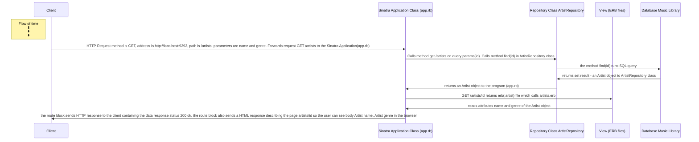

```mermaid
sequenceDiagram
  participant C as Client
  participant A as Sinatra Application Class (app.rb)
  participant R as Repository Class ArtistRepository
  participant V as View (ERB files)
  participant D as Database Music Library
  Note left of C: Flow of time <br />⬇ <br /> ⬇ <br /> ⬇ 
  C->>A: HTTP Request method is GET, address is http://localhost:9292, path is /artists, parameters are name and genre. Forwards request GET /artists to the Sinatra Application(app.rb)
  A->>R: Calls method get /artists on query params(id). Calls method find(id) in ArtistRepository class
  R->>D: the method find(id) runs SQL query
  D->>R: returns set result - an Artist object to ArtistRepository class
  R->>A: returns an Artist object to the program (app.rb)
  A->>V: GET /artists/id returns erb(:artist) file which calls artists.erb
  V->>A: reads attributes name and genre of the Artist object
  A->>C: the route block sends HTTP response to the client containing the data  response status 200 ok. the route block also sends a HTML response describing the page artists/id so the user can see body Artist name, Artist genre in the browser
```