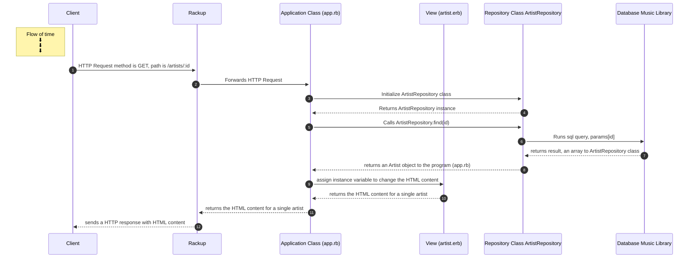

```mermaid
sequenceDiagram
  participant C as Client
  participant RU as Rackup
  participant A as Application Class (app.rb)
  participant V as View (artist.erb)
  participant R as Repository Class ArtistRepository
  participant D as Database Music Library
  Note left of C: Flow of time <br />⬇ <br /> ⬇ <br /> ⬇
  autonumber
  C->>+RU: HTTP Request method is GET, path is /artists/:id
  RU->>+A: Forwards HTTP Request
  A->>+R: Initialize ArtistRepository class
  R-->>A: Returns ArtistRepository instance
  A->>R: Calls ArtistRepository.find(id)
  R->>D: Runs sql query, params[id]
  D-->>R: returns result, an array to ArtistRepository class
  R-->>A: returns an Artist object to the program (app.rb)
  A->>V: assign instance variable to change the HTML content
  V-->>A: returns the HTML content for a single artist
  A-->>RU: returns the HTML content for a single artist
  RU-->>C: sends a HTTP response with HTML content
```