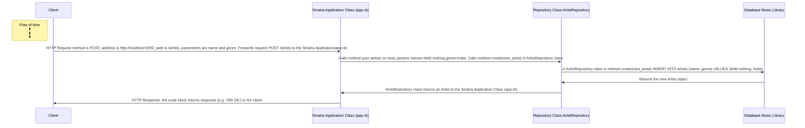

```mermaid
sequenceDiagram
  participant C as Client
  participant A as Sinatra Application Class (app.rb)
  participant R as Repository Class ArtistRepository
  participant D as Database Music Library
  Note left of C: Flow of time <br />⬇ <br /> ⬇ <br /> ⬇ 
  C->>A: HTTP Request method is POST, address is http://localhost:9292, path is /artists, parameters are name and genre. Forwards request POST /artists to the Sinatra Application(app.rb)
  A->>R: Calls method post /artists on body params names=Wild nothing,genre=Indie. Calls method create(new_artist) in ArtistRepository class
  R->>D: in ArtistRepository class in method create(new_artist) INSERT INTO artists (name, genre) VALUES (Wild nothing, Indie)
  D->>R: Returns the new Artist object
  R->>A: ArtistRepository class returns an Artist to the Sinatra Application Class (app.rb)
  A->>C: HTTP Response: the route block returns response (e.g. '200 OK') to the client.
```